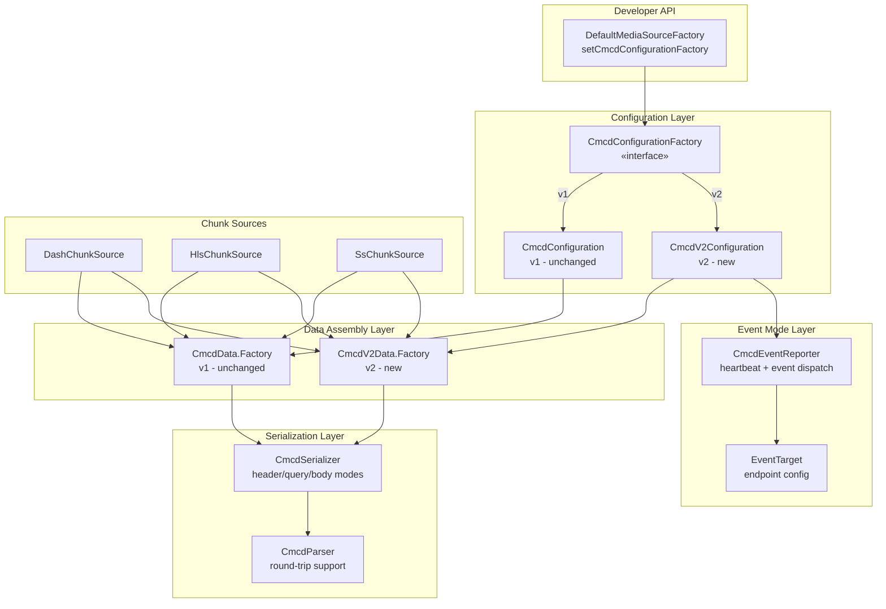
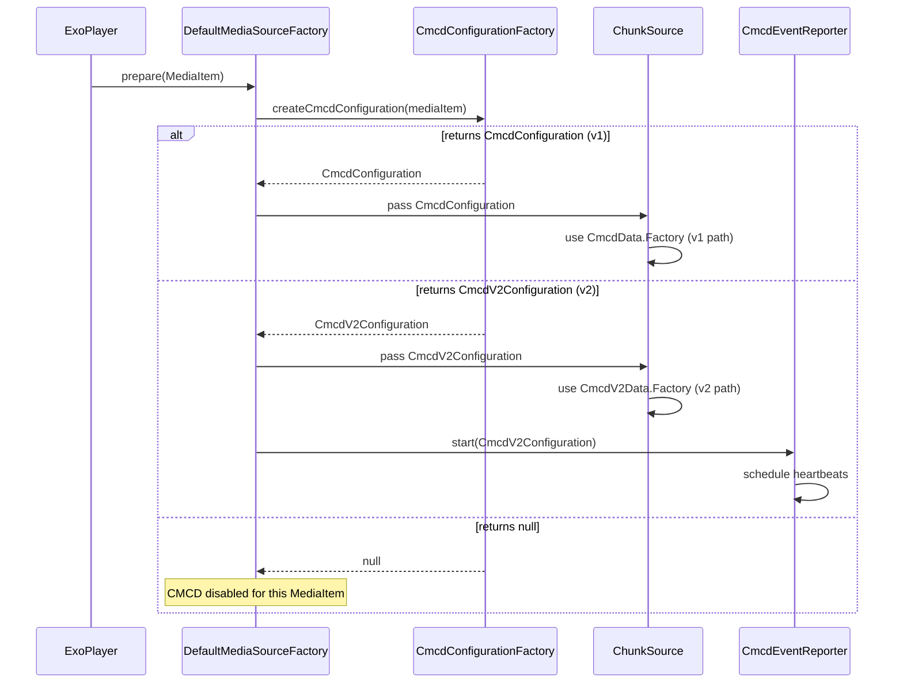
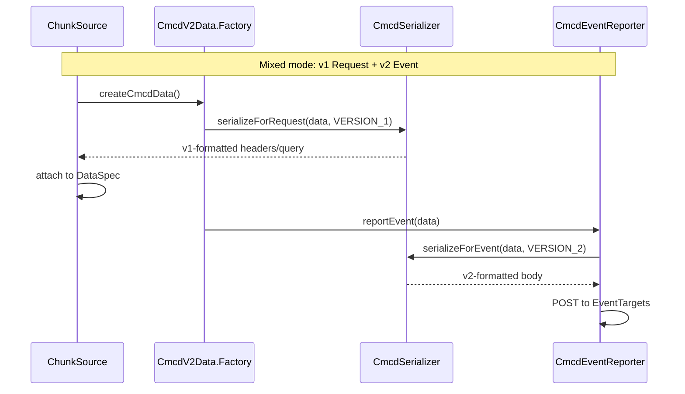
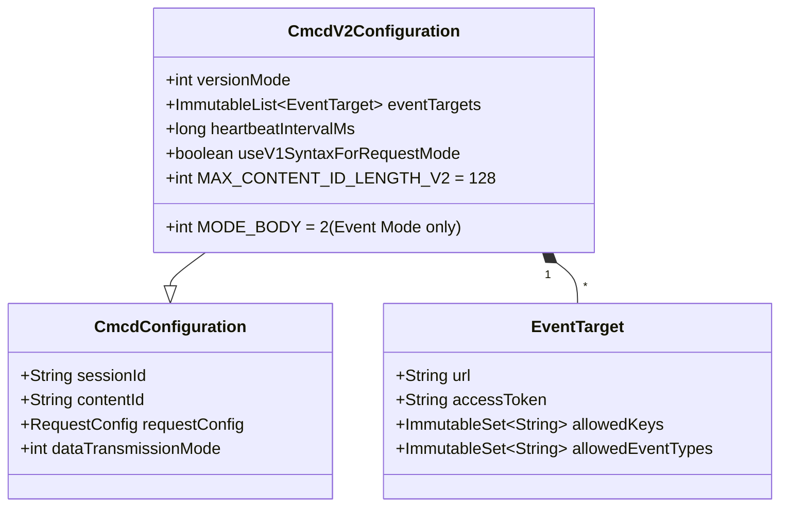
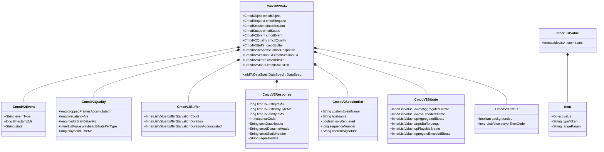

# Design Document: CMCD V2 Support

## Overview

This design extends the AndroidX Media3 CMCD implementation to support CTA-5004-B (CMCD v2) while preserving full backward compatibility with the existing v1 (CTA-5004) implementation. The approach uses a version-aware factory architecture where new v2 classes coexist alongside unchanged v1 classes, enabling per-MediaItem version selection, Event Mode reporting, body transmission, inner list syntax, and all new reserved keys.

### Design Goals

- **Zero breaking changes**: Existing `CmcdConfiguration`, `CmcdConfiguration.Factory`, `CmcdData`, and `CmcdData.Factory` remain unchanged.
- **Version coexistence**: A single player instance can serve v1-only, v2-only, or mixed-version payloads per MediaItem.
- **Clean separation**: V2 concerns (Event Mode, body transmission, inner lists) live in new classes without polluting the v1 code path.
- **Spec compliance**: Output conforms to CTA-5004-B structured field syntax (RFC 8941 inner lists), body format, and Event Mode semantics.
- **Testability**: Round-trip serialization/parsing enables property-based correctness verification.

### Key Design Decisions

| Decision | Rationale |
|----------|-----------|
| New `CmcdV2Configuration` class instead of modifying `CmcdConfiguration` | Preserves v1 binary compatibility; v2 has fundamentally different concerns (event targets, body mode, mixed version) |
| New `CmcdV2Data` class wrapping composition over `CmcdData` | Reuses v1 key population logic while adding v2 serialization, inner lists, and new keys |
| Unified `CmcdConfigurationFactory` interface dispatching to v1 or v2 | Single entry point for `DefaultMediaSourceFactory`; replaces per-version factory wiring |
| Event Mode as a standalone `CmcdEventReporter` component | Decouples heartbeat/event lifecycle from request-attached data flow |
| `CmcdSerializer` / `CmcdParser` utility classes | Isolates formatting logic for unit testing and round-trip verification |

---

## Architecture

### High-Level Component Diagram



### Version Resolution Flow



### Mixed Version Mode Flow



---

## Components and Interfaces

### 1. CmcdConfigurationFactory (Interface)

Replaces the entry-point role of `CmcdConfiguration.Factory` for new integrations while remaining compatible with existing v1 usage.

```java
package androidx.media3.exoplayer.upstream;

import androidx.annotation.Nullable;
import androidx.media3.common.MediaItem;
import androidx.media3.common.util.UnstableApi;

/**
 * Factory for creating version-specific CMCD configurations per MediaItem.
 *
 * <p>Returns either a {@link CmcdConfiguration} for v1 behavior or a
 * {@link CmcdV2Configuration} for v2/mixed behavior. Returning {@code null}
 * disables CMCD for that MediaItem.
 */
@UnstableApi
public interface CmcdConfigurationFactory {

  /**
   * Creates a CMCD configuration for the given media item.
   *
   * @param mediaItem The media item to configure CMCD for.
   * @return A {@link CmcdConfiguration} (v1), {@link CmcdV2Configuration} (v2), or
   *     {@code null} to disable CMCD.
   */
  @Nullable
  CmcdConfiguration createCmcdConfiguration(MediaItem mediaItem);
}
```

**Backward compatibility**: `CmcdConfiguration.Factory` extends `CmcdConfigurationFactory` so existing v1 factories work without modification.

### 2. CmcdV2Configuration

```java
package androidx.media3.exoplayer.upstream;

import androidx.media3.common.util.UnstableApi;
import com.google.common.collect.ImmutableList;

/**
 * Configuration for CMCD v2 (CTA-5004-B) reporting.
 *
 * <p>Extends {@link CmcdConfiguration} with v2-specific capabilities: Event Mode targets,
 * body transmission, mixed-version mode, and extended content ID length.
 */
@UnstableApi
public final class CmcdV2Configuration extends CmcdConfiguration {

  /** Maximum content ID length for v2 (128 characters). */
  public static final int MAX_CONTENT_ID_LENGTH_V2 = 128;

  /** Body transmission mode for HTTP POST body format. Only valid for Event Mode. */
  public static final int MODE_BODY = 2;

  /** The CMCD version this configuration targets. */
  @VersionMode
  public final int versionMode;

  /** Event targets for Event Mode reporting. Empty if Event Mode is disabled. */
  public final ImmutableList<EventTarget> eventTargets;

  /** Heartbeat interval in milliseconds. {@code 0} disables heartbeat. */
  public final long heartbeatIntervalMs;

  /** Whether Request Mode payloads use v1 syntax in mixed mode. */
  public final boolean useV1SyntaxForRequestMode;

  // Builder pattern for construction...
}
```

### 3. EventTarget

```java
package androidx.media3.exoplayer.upstream;

import androidx.annotation.Nullable;
import androidx.media3.common.util.UnstableApi;
import com.google.common.collect.ImmutableSet;

/**
 * Configuration for a single Event Mode reporting destination.
 */
@UnstableApi
public final class EventTarget {

  /** The endpoint URL to POST CMCD reports to. */
  public final String url;

  /** Access token for the Authorization header. {@code null} if unauthenticated. */
  @Nullable public final String accessToken;

  /**
   * Allowed CMCD keys for this target. Empty set means all keys are allowed.
   */
  public final ImmutableSet<String> allowedKeys;

  /**
   * Allowed event types for this target. Empty set means all events are allowed.
   */
  public final ImmutableSet<@EventType String> allowedEventTypes;

  /** Builder for constructing EventTarget instances. */
  public static final class Builder {
    // ...
  }
}
```

### 4. CmcdV2Data.Factory

```java
package androidx.media3.exoplayer.upstream;

import androidx.media3.common.util.UnstableApi;

/**
 * Factory for assembling CMCD v2 data payloads.
 *
 * <p>Extends the v1 {@link CmcdData.Factory} capabilities with new CTA-5004-B keys,
 * inner list value support, and accumulated metrics tracking.
 */
@UnstableApi
public final class CmcdV2Data {

  /** Factory for building CmcdV2Data instances. */
  public static final class Factory {

    public Factory(
        CmcdV2Configuration configuration,
        @CmcdData.StreamingFormat String streamingFormat) {
      // ...
    }

    // All existing v1 setters (delegated)...

    // New v2 key setters:
    @CanIgnoreReturnValue
    public Factory setState(@StateType String state);

    @CanIgnoreReturnValue
    public Factory setDroppedFramesAccumulated(long droppedFrames);

    @CanIgnoreReturnValue
    public Factory setLiveLatencyMs(long liveLatencyMs);

    @CanIgnoreReturnValue
    public Factory setMediaStartDelayMs(long mediaStartDelayMs);

    @CanIgnoreReturnValue
    public Factory setPlayheadBitratePerType(InnerListValue pb);

    @CanIgnoreReturnValue
    public Factory setPlayheadTimeMs(long playheadTimeMs);

    @CanIgnoreReturnValue
    public Factory setBufferStarvationCount(InnerListValue bsa);

    @CanIgnoreReturnValue
    public Factory setBufferStarvationDuration(InnerListValue bsd);

    @CanIgnoreReturnValue
    public Factory setBufferStarvationDurationAccumulated(InnerListValue bsda);

    @CanIgnoreReturnValue
    public Factory setTimeToFirstByteMs(long ttfbMs);

    @CanIgnoreReturnValue
    public Factory setTimeToFirstBodyByteMs(long ttfbbMs);

    @CanIgnoreReturnValue
    public Factory setTimeToLastByteMs(long ttlbMs);

    @CanIgnoreReturnValue
    public Factory setResponseCode(int responseCode);

    @CanIgnoreReturnValue
    public Factory setSmrtDataHeader(String smrt);

    @CanIgnoreReturnValue
    public Factory setCmsdDynamicHeader(String cmsdd);

    @CanIgnoreReturnValue
    public Factory setCmsdStaticHeader(String cmsds);

    @CanIgnoreReturnValue
    public Factory setRequestedUrl(String url);

    @CanIgnoreReturnValue
    public Factory setCustomEventName(String cen);

    @CanIgnoreReturnValue
    public Factory setHostname(String hostname);

    @CanIgnoreReturnValue
    public Factory setNonRendered(boolean nonRendered);

    @CanIgnoreReturnValue
    public Factory setSequenceNumber(long sequenceNumber);

    @CanIgnoreReturnValue
    public Factory setContentSignature(String contentSignature);

    @CanIgnoreReturnValue
    public Factory setEventType(@EventType String eventType);

    @CanIgnoreReturnValue
    public Factory setTimestampMs(long timestampMs);

    // New bitrate-related setters (inner list):
    @CanIgnoreReturnValue
    public Factory setLowestAggregatedBitratePerType(InnerListValue lab);

    @CanIgnoreReturnValue
    public Factory setLowestEncodedBitratePerType(InnerListValue lb);

    @CanIgnoreReturnValue
    public Factory setTopAggregatedBitratePerType(InnerListValue tab);

    @CanIgnoreReturnValue
    public Factory setTargetBufferLengthPerType(InnerListValue tbl);

    @CanIgnoreReturnValue
    public Factory setTopPlayableBitratePerType(InnerListValue tpb);

    @CanIgnoreReturnValue
    public Factory setAggregateEncodedBitratePerType(InnerListValue ab);

    // New status setters:
    @CanIgnoreReturnValue
    public Factory setBackgrounded(boolean backgrounded);

    @CanIgnoreReturnValue
    public Factory setPlayerErrorCode(InnerListValue ec);

    // Inner list support for existing v1 keys promoted to inner list in v2:
    @CanIgnoreReturnValue
    public Factory setBitratePerType(InnerListValue bitratePerType);

    @CanIgnoreReturnValue
    public Factory setBufferLengthPerType(InnerListValue bufferLengthPerType);

    @CanIgnoreReturnValue
    public Factory setMeasuredThroughputPerType(InnerListValue mtpPerType);

    @CanIgnoreReturnValue
    public Factory setTopBitratePerType(InnerListValue tbPerType);

    @CanIgnoreReturnValue
    public Factory setNextObjectRequestList(InnerListValue norList);

    /** Creates an immutable CmcdV2Data from the current factory state. */
    public CmcdV2Data createCmcdData();
  }
}
```

### 5. InnerListValue

```java
package androidx.media3.exoplayer.upstream;

import androidx.media3.common.util.UnstableApi;
import com.google.common.collect.ImmutableList;

/**
 * Represents an RFC 8941 inner list value for CMCD v2 per-object-type keys.
 *
 * <p>Example: {@code br=(5000;v 320;a)} represents bitrate 5000 for video, 320 for audio.
 */
@UnstableApi
public final class InnerListValue {

  /** A single item within an inner list, pairing a value with a type token. */
  public static final class Item {
    /** The numeric or string value. */
    public final Object value;

    /** The object type token (e.g., "v", "a", "av"). */
    @Nullable public final String typeToken;

    /** Range parameter for 'nor' entries. */
    @Nullable public final String rangeParam;
  }

  /** The ordered list of items. */
  public final ImmutableList<Item> items;

  /** Builder for constructing InnerListValue instances. */
  public static final class Builder {
    @CanIgnoreReturnValue
    public Builder addItem(Object value, @Nullable String typeToken);

    @CanIgnoreReturnValue
    public Builder addItemWithRange(String value, @Nullable String range);

    public InnerListValue build();
  }
}
```

### 6. CmcdSerializer

```java
package androidx.media3.exoplayer.upstream;

import androidx.media3.common.util.UnstableApi;
import com.google.common.collect.ImmutableMap;

/**
 * Serializes CMCD data into spec-compliant string representations.
 *
 * <p>Supports header mode, query parameter mode (for Request Mode), and body mode
 * formatting (for Event Mode only) for both v1 and v2 payload syntax.
 */
@UnstableApi
public final class CmcdSerializer {

  /** Serializes CMCD data to header-mode format (4 separate header strings). */
  public static ImmutableMap<String, String> toHeaders(CmcdKeyValueStore data);

  /** Serializes CMCD data to query-parameter-mode format (single encoded string). */
  public static String toQueryParameter(CmcdKeyValueStore data);

  /** Serializes CMCD data to body-mode format (one or more CMCD records separated by LF (0x0A),
   *  each record being comma-separated key=value pairs without URL encoding and without header
   *  group prefixes. If only a single record is present, no trailing LF is included). */
  public static String toBody(CmcdKeyValueStore data);

  /** Formats a single key-value pair according to CMCD formatting rules. */
  static String formatValue(String key, Object value);

  /** Formats an InnerListValue to RFC 8941 inner list syntax. */
  static String formatInnerList(InnerListValue innerList);
}
```

### 7. CmcdParser

```java
package androidx.media3.exoplayer.upstream;

import androidx.media3.common.util.UnstableApi;
import com.google.common.collect.ImmutableMap;

/**
 * Parses CMCD-formatted strings back into structured key-value data.
 *
 * <p>Supports header mode, query parameter mode, and body mode parsing.
 * Used for round-trip verification in tests and for consuming CMCD data
 * from external sources.
 */
@UnstableApi
public final class CmcdParser {

  /** Parses header-mode CMCD strings into a key-value map. */
  public static ImmutableMap<String, Object> fromHeaders(
      ImmutableMap<String, String> headers);

  /** Parses a query-parameter-mode CMCD string into a key-value map. */
  public static ImmutableMap<String, Object> fromQueryParameter(String queryValue);

  /** Parses a body-mode CMCD string into a key-value map. */
  public static ImmutableMap<String, Object> fromBody(String body);

  /** Parses an RFC 8941 inner list string into an InnerListValue. */
  static InnerListValue parseInnerList(String innerListStr);
}
```

### 8. CmcdEventReporter

```java
package androidx.media3.exoplayer.upstream;

import android.os.Handler;
import androidx.media3.common.util.UnstableApi;

/**
 * Manages Event Mode CMCD reporting: heartbeat scheduling and event-triggered dispatch.
 *
 * <p>Lifecycle is tied to a playback session. Created when a v2 configuration with
 * event targets is active; stopped when playback ends or media item changes.
 */
@UnstableApi
public final class CmcdEventReporter {

  /** Listener for Event Mode lifecycle callbacks. */
  public interface Listener {
    /** Called when an event report fails delivery. */
    void onEventReportFailed(EventTarget target, Exception error);
  }

  public CmcdEventReporter(
      CmcdV2Configuration configuration,
      Handler handler,
      Listener listener);

  /** Starts heartbeat scheduling. */
  public void start();

  /** Stops heartbeat and cancels pending reports. */
  public void stop();

  /** Reports an event-triggered CMCD payload to applicable targets. */
  public void reportEvent(@EventType String eventType, CmcdV2Data data);

  /** Reports a heartbeat CMCD payload to applicable targets. */
  public void reportHeartbeat(CmcdV2Data data);
}
```

### 9. Type Annotations (New)

```java
/** Event types for Event Mode reporting per CTA-5004-B. */
@StringDef({
  EventType.AD_BREAK_START,
  EventType.AD_BREAK_END,
  EventType.AD_END,
  EventType.AD_START,
  EventType.BACKGROUNDED,
  EventType.BITRATE_CHANGE,
  EventType.CONTENT_ID_CHANGE,
  EventType.CUSTOM_EVENT,
  EventType.ERROR,
  EventType.HOSTNAME_CHANGE,
  EventType.MUTE,
  EventType.PLAYER_COLLAPSE,
  EventType.PLAYER_EXPAND,
  EventType.PLAYBACK_RATE_CHANGE,
  EventType.PLAY_STATE_CHANGE,
  EventType.RESPONSE_RECEIVED,
  EventType.SKIP,
  EventType.TIME_INTERVAL,
  EventType.UNMUTE
})
@Retention(RetentionPolicy.SOURCE)
public @interface EventType {
  String AD_BREAK_START = "abs";
  String AD_BREAK_END = "abe";
  String AD_END = "ae";
  String AD_START = "as";
  String BACKGROUNDED = "b";
  String BITRATE_CHANGE = "bc";
  String CONTENT_ID_CHANGE = "c";
  String CUSTOM_EVENT = "ce";
  String ERROR = "e";
  String HOSTNAME_CHANGE = "h";
  String MUTE = "m";
  String PLAYER_COLLAPSE = "pc";
  String PLAYER_EXPAND = "pe";
  String PLAYBACK_RATE_CHANGE = "pr";
  String PLAY_STATE_CHANGE = "ps";
  String RESPONSE_RECEIVED = "rr";
  String SKIP = "sk";
  String TIME_INTERVAL = "t";
  String UNMUTE = "um";
}

/** State type tokens for the 'sta' key per CTA-5004-B. */
@StringDef({
  StateType.STARTING,
  StateType.PLAYING,
  StateType.SEEKING,
  StateType.REBUFFERING,
  StateType.PAUSED,
  StateType.ENDED,
  StateType.FATAL_ERROR,
  StateType.QUIT,
  StateType.PRELOADING
})
@Retention(RetentionPolicy.SOURCE)
public @interface StateType {
  String STARTING = "s";
  String PLAYING = "p";
  String SEEKING = "k";
  String REBUFFERING = "r";
  String PAUSED = "a";
  String ENDED = "e";
  String FATAL_ERROR = "f";
  String QUIT = "q";
  String PRELOADING = "d";
}

/** Version mode for mixed-version configurations. */
@IntDef({VersionMode.V2_ONLY, VersionMode.MIXED_V1_REQUEST_V2_EVENT})
@Retention(RetentionPolicy.SOURCE)
public @interface VersionMode {
  int V2_ONLY = 0;
  int MIXED_V1_REQUEST_V2_EVENT = 1;
}
```

---

## Data Models

### CmcdV2Configuration Data Model



### CmcdV2Data Data Model



### New CMCD Key Constants and Header Group Assignments

| Constant | Key | Header Group | Type | Category |
|----------|-----|--------------|------|----------|
| `KEY_EVENT_TYPE` | `e` | N.A (Event only) | Token | Event |
| `KEY_STATE` | `sta` | CMCD-Request | Token | Event |
| `KEY_TIMESTAMP` | `ts` | N.A (Event only) | Integer | Event |
| `KEY_DROPPED_FRAMES_ACCUMULATED` | `dfa` | CMCD-Request | Integer | Quality |
| `KEY_LIVE_LATENCY` | `ltc` | CMCD-Request | Integer | Quality |
| `KEY_MEDIA_START_DELAY` | `msd` | CMCD-Session | Integer | Quality |
| `KEY_PLAYHEAD_BITRATE` | `pb` | CMCD-Request | Inner list | Quality |
| `KEY_PLAYHEAD_TIME` | `pt` | CMCD-Status | Integer | Quality |
| `KEY_BUFFER_STARVATION_COUNT` | `bsa` | CMCD-Status | Inner list | Buffer |
| `KEY_BUFFER_STARVATION_DURATION` | `bsd` | CMCD-Status | Inner list | Buffer |
| `KEY_BUFFER_STARVATION_DURATION_ACCUMULATED` | `bsda` | CMCD-Status | Inner list | Buffer |
| `KEY_CMSD_DYNAMIC_HEADER` | `cmsdd` | N.A (Event only) | String | Response |
| `KEY_CMSD_STATIC_HEADER` | `cmsds` | N.A (Event only) | String | Response |
| `KEY_RESPONSE_CODE` | `rc` | N.A (Event only) | Integer | Response |
| `KEY_SMRT_DATA_HEADER` | `smrt` | N.A (Event only) | String | Response |
| `KEY_TIME_TO_FIRST_BYTE` | `ttfb` | N.A (Event only) | Integer | Response |
| `KEY_TIME_TO_FIRST_BODY_BYTE` | `ttfbb` | N.A (Event only) | Integer | Response |
| `KEY_TIME_TO_LAST_BYTE` | `ttlb` | N.A (Event only) | Integer | Response |
| `KEY_REQUESTED_URL` | `url` | N.A (Event only) | String | Response |
| `KEY_CUSTOM_EVENT_NAME` | `cen` | N.A (Event only) | String | Session |
| `KEY_HOSTNAME` | `h` | N.A (Event only) | String | Session |
| `KEY_NON_RENDERED` | `nr` | CMCD-Status | Boolean | Session |
| `KEY_SEQUENCE_NUMBER` | `sn` | CMCD-Request | Integer | Session |
| `KEY_CONTENT_SIGNATURE` | `cs` | CMCD-Request | String | Integrity |
| `KEY_LOWEST_AGGREGATED_BITRATE` | `lab` | CMCD-Object | Inner list | Bitrate |
| `KEY_LOWEST_ENCODED_BITRATE` | `lb` | CMCD-Object | Inner list | Bitrate |
| `KEY_TOP_AGGREGATED_BITRATE` | `tab` | CMCD-Object | Inner list | Bitrate |
| `KEY_TARGET_BUFFER_LENGTH` | `tbl` | CMCD-Request | Inner list | Bitrate |
| `KEY_TOP_PLAYABLE_BITRATE` | `tpb` | CMCD-Object | Inner list | Bitrate |
| `KEY_AGGREGATE_ENCODED_BITRATE` | `ab` | CMCD-Object | Inner list | Bitrate |
| `KEY_BACKGROUNDED` | `bg` | CMCD-Status | Boolean | Status |
| `KEY_PLAYER_ERROR_CODE` | `ec` | CMCD-Status | Inner list | Status |

### Stream Type and Format Extensions

| Constant | Value | Description |
|----------|-------|-------------|
| `STREAM_TYPE_LOW_LATENCY_LIVE` | `ll` | Low-latency LIVE stream |
| `STREAMING_FORMAT_HESP` | `e` | HESP streaming format |

### Version Key Behavior

| Mode | `v` key in Request Mode | `v` key in Event Mode |
|------|------------------------|----------------------|
| v1 only | Omitted | N/A |
| v2 only | `v=2` | `v=2` |
| Mixed (v1 req + v2 event) | Omitted | `v=2` |


---

## Correctness Properties

*A property is a characteristic or behavior that should hold true across all valid executions of a system—essentially, a formal statement about what the system should do. Properties serve as the bridge between human-readable specifications and machine-verifiable correctness guarantees.*

### Property 1: Serialization/Parsing Round-Trip

*For any* valid `CmcdV2Data` object (or `CmcdData` object), serializing to any supported format (header mode, query parameter mode, or body mode) and then parsing the result back SHALL produce a key-value map equivalent to the original data.

**Validates: Requirements 15.5, 16.1, 16.2, 16.3, 16.4, 16.5**

### Property 2: V1 Serialization Invariant

*For any* valid `CmcdData` object assembled through the v1 `CmcdData.Factory` path, the serialized output SHALL NOT contain the `v` key, SHALL format `nor` as a single quoted string, SHALL include `nrr` as a separate key when range data is present, and SHALL otherwise match the CTA-5004 formatting specification.

**Validates: Requirements 1.2, 2.2, 2.4, 6.3**

### Property 3: V2 Version Key Inclusion

*For any* `CmcdV2Data` object serialized in v2 mode (not mixed-mode request path), the output SHALL contain the key-value pair `v=2` in the session group.

**Validates: Requirements 1.3, 13.2**

### Property 4: Content ID Length Validation

*For any* string of length `n`, creating a v1 `CmcdConfiguration` with that string as content ID SHALL succeed if and only if `n <= 64`, and creating a `CmcdV2Configuration` with that string as content ID SHALL succeed if and only if `n <= 128`. Strings exceeding the applicable limit SHALL cause `IllegalArgumentException`.

**Validates: Requirements 2.5, 8.1, 8.2, 8.3**

### Property 5: Event Report Required Metadata

*For any* Event Mode report generated by `CmcdEventReporter`, the serialized payload SHALL contain both the `e` (event type) key and the `ts` (timestamp) key.

**Validates: Requirements 3.5, 3.6**

### Property 6: Key Filtering

*For any* set of populated CMCD keys and *for any* `EventTarget` with an allowed-key set, the report sent to that target SHALL contain only keys that are in the intersection of {populated keys} and {allowed keys}. When the allowed-key set is empty (no filter configured), all populated keys SHALL be included.

**Validates: Requirements 3.8, 11.3, 11.5**

### Property 7: Event Type Filtering and Dispatch

*For any* event type and *for any* set of `EventTarget` configurations, a report SHALL be sent to a target if and only if the target's allowed-event-type set is empty (no filter) or contains the event type. When the event type is not in a target's allowed list, the entire report to that target SHALL be suppressed.

**Validates: Requirements 3.4, 11.4**

### Property 8: Body Format Structure

*For any* valid `CmcdV2Data` object serialized in body mode, the output SHALL consist of one or more CMCD records separated by LF characters (Unicode 0x0A), where each record uses the same format as query arguments (comma-separated key=value pairs) without URL encoding and without header group prefixes. Records with no populated keys SHALL be omitted from the output. If only a single record is present, no trailing LF SHALL be included.

**Validates: Requirements 4.1, 4.3, 4.4, 4.5, 15.4**

### Property 9: Inner List Serialization

*For any* `InnerListValue` with multiple items assigned to keys `bl`, `br`, `mtp`, `nor`, `tb`, `lab`, `lb`, `tab`, `tbl`, `tpb`, `bsa`, `bsd`, `bsda`, `pb`, `ec`, or `ab` in v2 mode, the serialized output SHALL use RFC 8941 inner list syntax: `key=(value1;type1 value2;type2)`. *For any* `InnerListValue` with exactly one item and no type token, the output SHALL use standard scalar format.

**Validates: Requirements 5.1, 5.2, 5.3, 15.1**

### Property 10: V2 'nor' Key Format

*For any* `CmcdV2Data` object with next-object-request data serialized in v2 mode, the `nor` key SHALL be formatted as an inner list of strings. Range parameters SHALL appear as parameters on inner list items (e.g., `nor=("url1";r="0-100" "url2")`). The `nrr` key SHALL never appear in v2 output.

**Validates: Requirements 6.1, 6.2, 6.4**

### Property 11: Key-to-Header-Group Assignment

*For any* populated CMCD key in a `CmcdV2Data` object serialized in header mode, the key SHALL appear in the header line corresponding to its assigned group (CMCD-Object, CMCD-Request, CMCD-Session, or CMCD-Status) and in no other header line.

**Validates: Requirements 7.1, 7.2, 7.3, 7.4, 7.5, 7.6, 7.7, 7.8**

### Property 12: Mixed Mode Version Syntax

*For any* `CmcdV2Data` object in mixed-version mode: (a) serialization for Request Mode SHALL omit the `v` key and use v1 `nor`/`nrr` formatting, and (b) serialization for Event Mode SHALL include `v=2` and use v2 inner list `nor` formatting without `nrr`.

**Validates: Requirements 10.2, 10.3, 10.4**

### Property 13: Key Omission for Unset Values

*For any* subset of keys that are NOT explicitly set on the `CmcdV2Data.Factory`, those keys SHALL NOT appear in the serialized output regardless of transmission mode.

**Validates: Requirements 13.5**

### Property 14: Alphabetical Key Ordering

*For any* set of populated keys within a single header group, the serialized output line for that group SHALL list keys in lexicographic (alphabetical) order.

**Validates: Requirements 15.2**

### Property 15: Value Type Formatting

*For any* integer value, the serialized form SHALL be a bare decimal number. *For any* boolean true value, the serialized form SHALL be key-only (no `=`). *For any* string value, the serialized form SHALL be double-quoted. *For any* float value, the serialized form SHALL have exactly two decimal places.

**Validates: Requirements 15.3**

### Property 16: Stream Type and Format Emission

*For any* `CmcdV2Data` object where the stream type is set to low-latency LIVE, the output SHALL contain `st=ll`. *For any* object where the streaming format is set to HESP, the output SHALL contain `sf=e`.

**Validates: Requirements 9.3, 9.4**

---

## Error Handling

### Configuration Errors

| Error Condition | Behavior | Exception |
|----------------|----------|-----------|
| Content ID exceeds v1 max (64 chars) | Reject at construction | `IllegalArgumentException` |
| Content ID exceeds v2 max (128 chars) | Reject at construction | `IllegalArgumentException` |
| Session ID exceeds 64 chars | Reject at construction (unchanged) | `IllegalArgumentException` |
| Invalid custom data key (no hyphen) | Reject at `createCmcdData()` | `IllegalStateException` |
| Null `RequestConfig` | Reject at construction | `NullPointerException` |
| Empty EventTarget URL | Reject at `EventTarget.Builder.build()` | `IllegalArgumentException` |

### Data Assembly Errors

| Error Condition | Behavior | Exception |
|----------------|----------|-----------|
| Missing `trackSelection` for non-manifest object | Reject at `createCmcdData()` | `IllegalStateException` |
| Missing `bufferedDurationUs` for media object type | Reject at `createCmcdData()` | `IllegalStateException` |
| Missing `chunkDurationUs` for media object type | Reject at `createCmcdData()` | `IllegalStateException` |
| Negative accumulated metric value | Clamp to 0 | — |

### Event Mode Errors

| Error Condition | Behavior |
|----------------|----------|
| HTTP POST to Event Target fails (network error) | Log warning via `Listener.onEventReportFailed()`, do not retry, do not interrupt playback |
| HTTP POST returns 4xx/5xx | Log warning, do not retry |
| Event Target URL unreachable | Skip target, continue with remaining targets |
| Heartbeat fires after `stop()` called | Ignore (Handler message cleared on stop) |

### Serialization Errors

| Error Condition | Behavior | Exception |
|----------------|----------|-----------|
| Null key value passed to serializer | Skip key (same as "not set") | — |
| Inner list with zero items | Omit key entirely | — |
| Invalid InnerListValue type token | Reject at `InnerListValue.Builder.build()` | `IllegalArgumentException` |

### Parsing Errors

| Error Condition | Behavior | Exception |
|----------------|----------|-----------|
| Malformed CMCD string | Return partial parse result + log warning | — |
| Unknown key encountered | Preserve as opaque string value | — |
| Invalid inner list syntax | Treat as raw string value | — |

---

## Testing Strategy

### Property-Based Testing (PBT)

This feature is well-suited for property-based testing because:
- The serializer/parser are pure functions with clear input/output
- Universal properties (round-trip, format correctness, filtering) hold across large input spaces
- Input variation (different key combinations, value types, inner lists) reveals edge cases
- Tests are cost-effective (in-memory, no I/O)

**Library**: [jqwik](https://jqwik.net/) — the standard PBT library for Java/JUnit 5

**Configuration**:
- Minimum 100 iterations per property test
- Each property test tagged with design document reference
- Tag format: `Feature: cmcd-v2-support, Property {number}: {property_text}`

**Generators needed**:
- `CmcdV2Data` generator: Random subsets of keys populated with valid values
- `InnerListValue` generator: Random items with valid type tokens
- `EventTarget` generator: Random URL, token, filter configs
- `CmcdV2Configuration` generator: Random version modes, transmission modes, event targets
- `String` generators: Random strings of various lengths for content IDs, URLs
- Value type generators: Random integers, floats, booleans, quoted strings

### Unit Tests (Example-Based)

| Test Area | Coverage |
|-----------|----------|
| `CmcdV2ConfigurationTest` | Builder validation, version mode selection, content ID limits |
| `EventTargetTest` | Builder validation, filter configuration |
| `CmcdV2DataFactoryTest` | Key population, precondition checks, accumulated metrics |
| `CmcdSerializerTest` | Specific format examples for each mode |
| `CmcdParserTest` | Specific parsing examples, error recovery |
| `InnerListValueTest` | Builder validation, single-item scalar fallback |
| `CmcdEventReporterTest` | Event dispatch, heartbeat scheduling (mocked time) |

### Integration Tests

| Test Area | Coverage |
|-----------|----------|
| `DefaultDashChunkSourceV2Test` | V2 data assembly in DASH chunk loading |
| `HlsChunkSourceV2Test` | V2 data assembly in HLS chunk loading |
| `DefaultSsChunkSourceV2Test` | V2 data assembly in SmoothStreaming chunk loading |
| `CmcdEventReporterIntegrationTest` | HTTP POST dispatch with mocked HTTP client |
| `MixedModeIntegrationTest` | V1 request + V2 event coexistence |

### E2E Tests

| Test Area | Coverage |
|-----------|----------|
| `DashPlaybackV2Test` | Full DASH playback with v2 CMCD enabled |
| `HlsPlaybackV2Test` | Full HLS playback with v2 CMCD enabled |
| `EventModePlaybackTest` | Playback with Event Mode reporting to mock server |

### Test Execution

```
# Run all CMCD v2 unit tests
./gradlew :libraries:exoplayer:testDebug --tests "*.upstream.Cmcd*"

# Run property-based tests specifically
./gradlew :libraries:exoplayer:testDebug --tests "*.upstream.CmcdPropertyTest"

# Run integration tests
./gradlew :libraries:exoplayer_dash:testDebug --tests "*.DefaultDashChunkSourceV2Test"
./gradlew :libraries:exoplayer_hls:testDebug --tests "*.HlsChunkSourceV2Test"
```
